# Astraeus - A general-purpose AI Agent Platform

[](LICENSE)
[](https://python.org)
[](https://fastapi.tiangolo.com)
[](https://nodejs.org)

Astraeus is a comprehensive, production-ready AI Agent platform designed for local private deployment and global developer ecosystems. It enables the creation, deployment, and management of intelligent agents with powerful capabilities in a secure, scalable environment.

## 🌟 Key Features

- 🤖 **Multi-Model Support** - Integrates with various LLM providers (DeepSeek, GPT-4o, Qwen, etc.)
- 🛡️ **Sandboxed Execution** - PPIO-based isolation for secure agent operations
- 🌐 **Web Automation** - Built-in browser automation with Playwright
- 📦 **Rich Tool Ecosystem** - Computer use, web search, code interpreter, and more
- ⚡ **Background Processing** - Asynchronous task execution with Dramatiq
- 🔐 **Authentication & Security** - JWT-based auth with encrypted credentials
- 📊 **Observability** - Integrated logging with Structlog and Langfuse
- 🔧 **External Integrations** - Support for Composio, MCP, and Pipedream
- 🏠 **Local Deployment** - Complete private deployment with PostgreSQL and Redis
- 🇨🇳 **China Optimized** - Designed for Chinese developers and services

## 🏗️ 系统架构

Astraeus 采用现代化的分布式架构设计，专为本地私有部署优化：

### 核心架构组件：
- ✅ **PostgreSQL** - 本地数据持久化存储
- ✅ **PPIO 沙箱环境** - 安全的代理执行环境
- ✅ **Google ADK 框架** - 统一的 LLM 管理接口
- ✅ **FastAPI** - 高性能异步 API 服务
- ✅ **Next.js 15** - 现代化前端框架

### 系统整体架构图

```mermaid
graph TB
    %% 用户层
    subgraph "用户界面层"
        WEB[Web 浏览器]
        UI[Next.js 前端应用]
    end

    %% API 网关层
    subgraph "API 网关层"
        API[FastAPI 服务器]
        AUTH[JWT 认证中间件]
        CORS[CORS 中间件]
    end

    %% 业务服务层
    subgraph "业务服务层"
        AGENT_SVC[代理服务]
        PROJECT_SVC[项目管理服务]
        THREAD_SVC[对话线程服务]
        BILLING_SVC[计费服务]
        SANDBOX_SVC[沙箱管理服务]
        TRIGGER_SVC[触发器服务]
    end

    %% 核心组件层
    subgraph "核心组件层"
        ADK[Google ADK 框架]
        LLM[LLM 管理器]
        WORKFLOW[工作流引擎]
        TOOL_REGISTRY[工具注册表]
        MCP[MCP 集成]
    end

    %% 工具执行层
    subgraph "工具执行层"
        COMPUTER[计算机使用工具]
        BROWSER[浏览器自动化工具]
        SEARCH[网络搜索工具]
        CODE[代码解释器工具]
        DATA[数据提供者工具]
    end

    %% 沙箱环境层
    subgraph "沙箱环境层"
        PPIO[PPIO 云沙箱]
        DOCKER[Docker 容器]
        VNC[VNC 远程桌面]
    end

    %% 后台任务层
    subgraph "后台任务层"
        DRAMATIQ[Dramatiq 任务队列]
        WORKER[后台工作进程]
        SCHEDULER[任务调度器]
    end

    %% 数据存储层
    subgraph "数据存储层"
        POSTGRES[(PostgreSQL 主库)]
        REDIS[(Redis 缓存)]
        FILES[文件存储]
        SCREENSHOTS[截图存储]
    end

    %% 外部集成层
    subgraph "外部集成层"
        DEEPSEEK[DeepSeek API]
        OPENAI[OpenAI API]
        QWEN[通义千问 API]
        TAVILY[Tavily 搜索]
        FIRECRAWL[Firecrawl API]
        COMPOSIO[Composio 集成]
        LANGFUSE[Langfuse 监控]
    end

    %% 连接关系
    WEB --> UI
    UI -.->|HTTPS/WebSocket| API
    API --> AUTH
    AUTH --> CORS

    API --> AGENT_SVC
    API --> PROJECT_SVC
    API --> THREAD_SVC
    API --> BILLING_SVC
    API --> SANDBOX_SVC
    API --> TRIGGER_SVC

    AGENT_SVC --> ADK
    ADK --> LLM
    ADK --> WORKFLOW
    ADK --> TOOL_REGISTRY
    MCP --> TOOL_REGISTRY

    TOOL_REGISTRY --> COMPUTER
    TOOL_REGISTRY --> BROWSER
    TOOL_REGISTRY --> SEARCH
    TOOL_REGISTRY --> CODE
    TOOL_REGISTRY --> DATA

    COMPUTER --> PPIO
    BROWSER --> PPIO
    SANDBOX_SVC --> PPIO
    PPIO --> DOCKER
    PPIO --> VNC

    API -.->|异步任务| DRAMATIQ
    DRAMATIQ --> WORKER
    DRAMATIQ --> SCHEDULER

    AGENT_SVC --> POSTGRES
    PROJECT_SVC --> POSTGRES
    THREAD_SVC --> POSTGRES
    BILLING_SVC --> POSTGRES
    AUTH --> POSTGRES

    API --> REDIS
    DRAMATIQ --> REDIS
    WORKER --> REDIS

    LLM --> DEEPSEEK
    LLM --> OPENAI
    LLM --> QWEN
    SEARCH --> TAVILY
    BROWSER --> FIRECRAWL

    ADK --> COMPOSIO
    ADK --> LANGFUSE

    COMPUTER --> SCREENSHOTS
    BROWSER --> SCREENSHOTS
    API --> FILES

    style WEB fill:#e1f5fe
    style API fill:#f3e5f5
    style ADK fill:#e8f5e9
    style PPIO fill:#fff3e0
    style POSTGRES fill:#fce4ec
    style REDIS fill:#f1f8e9
```



### 技术栈概览

```mermaid
pie title 技术栈分布
    "前端技术" : 25
    "后端服务" : 30
    "数据存储" : 15
    "AI/LLM" : 20
    "DevOps" : 10
```



## 🚀 Quick Start

### Prerequisites

- **Backend**: Python 3.11+
- **Frontend**: Node.js 18+
- **Databases**: PostgreSQL 17+, Redis 7+
- **Docker** (optional for containerized deployment)
- **PPIO Account** (for sandbox environments)

### Installation

#### 1. Clone the repository
```bash
git clone https://github.com/zcxGGmu/Astraeus.git
cd Astraeus
```

#### 2. Frontend Setup
```bash
cd frontend  # Navigate to frontend directory
npm install  # or use: npm ci for clean install
npm run dev  # Start frontend on http://localhost:3000
```

#### 3. Backend Setup
```bash
cd backend  # Navigate to backend directory

# Create virtual environment
conda create -n astraeus python=3.11
conda activate astraeus

# Install dependencies
pip install -r requirements.txt
```

#### 4. Database Setup
```bash
# Start PostgreSQL and Redis services
# (See detailed setup instructions below)

# Configure database
python scripts/01_setup_database.py  # Configure PostgreSQL
python scripts/02_setup_redis.py     # Configure Redis
python scripts/03_init_astraeus_table.py  # Initialize tables
```

#### 5. Environment Configuration
Create a `.env` file in the backend directory:

```env
# Database Configuration
POSTGRES_HOST=localhost
POSTGRES_PORT=5432
POSTGRES_DB=astraeus
POSTGRES_USER=postgres
POSTGRES_PASSWORD=your_password

# Redis Configuration
REDIS_HOST=localhost
REDIS_PORT=6379
REDIS_PASSWORD=your_redis_password

# PPIO Sandbox Configuration
E2B_DOMAIN=sandbox.ppio.cn
E2B_API_KEY=your_ppio_api_key
SANDBOX_TEMPLATE_CODE=br263f8awvhrqd7ss1ze
SANDBOX_TEMPLATE_DESKTOP=4imxoe43snzcxj95hvha
SANDBOX_TEMPLATE_BROWSER=7xvs3snis3tkuq3y8u96
SANDBOX_TEMPLATE_BASE=txi15v1zt0q72i1gcyqb

# LLM Configuration
# For DeepSeek
DEEPSEEK_API_KEY=your_deepseek_api_key
DEEPSEEK_API_BASE=https://api.deepseek.com
MODEL_TO_USE=deepseek/deepseek-chat

# For OpenAI
OPENAI_API_KEY=your_openai_api_key
OPENAI_API_BASE=https://api.openai.com/v1
# MODEL_TO_USE=gpt-4o

# Other API Keys
TAVILY_API_KEY=your_tavily_api_key
FIRECRAWL_API_KEY=your_firecrawl_api_key

# Application Settings
ENV_MODE=local
LOGGING_LEVEL=INFO
```

#### 6. Start Services
```bash
# Terminal 1: Start FastAPI server
python api.py

# Terminal 2: Start background workers
dramatiq run_agent_background
```

#### 7. Access the Application
- Frontend: http://localhost:3000
- API: http://localhost:8000
- API Docs: http://localhost:8000/docs

## 📋 Environment Configuration

### Database Setup

#### PostgreSQL Installation

**Windows:**
1. Download from [EnterpriseDB](https://www.enterprisedb.com/downloads/postgres-postgresql-downloads)
2. Run installer with default settings
3. Set password for postgres user
4. Install pgAdmin for database management

**Linux (Ubuntu/Debian):**
```bash
sudo apt update
sudo apt install postgresql postgresql-contrib
sudo systemctl start postgresql
sudo systemctl enable postgresql
```

Create database:
```sql
CREATE DATABASE astraeus;
CREATE USER astraeus WITH PASSWORD 'your_password';
GRANT ALL PRIVILEGES ON DATABASE astraeus TO astraeus;
```

#### Redis Installation

**Windows:**
1. Download from [redis-windows](https://github.com/redis-windows/redis-windows/releases)
2. Extract and run: `redis-server redis.conf`

**Linux:**
```bash
# Ubuntu/Debian
sudo apt install redis-server

# Or compile from source
wget http://download.redis.io/releases/redis-7.0.4.tar.gz
tar -zxvf redis-7.0.4.tar.gz
cd redis-7.0.4
make
make install
redis-server redis.conf
```

### PPIO Sandbox Setup

1. Register at [PPIO Console](https://ppio.com/console)
2. Get API key from dashboard
3. Note template IDs from your sandbox templates

## 🔧 核心功能模块架构

### 1. 代理执行系统架构

```mermaid
sequenceDiagram
    participant User as 用户
    participant Frontend as 前端应用
    participant API as FastAPI服务
    participant Agent as 代理服务
    participant ADK as Google ADK
    participant LLM as LLM服务
    participant Tool as 工具系统
    participant Sandbox as 沙箱环境
    participant DB as 数据库

    User->>Frontend: 发送任务请求
    Frontend->>API: POST /api/agents/{id}/run
    API->>Agent: 创建代理执行实例
    Agent->>DB: 保存执行记录

    loop 代理执行循环
        Agent->>ADK: 处理用户输入
        ADK->>LLM: 获取模型响应
        LLM-->>ADK: 返回响应/工具调用
        alt 需要工具调用
            ADK->>Tool: 执行工具
            Tool->>Sandbox: 在沙箱中执行
            Sandbox-->>Tool: 返回执行结果
            Tool-->>ADK: 返回结果
        end
        ADK-->>Agent: 返回执行状态
        Agent->>DB: 更新执行状态
        Agent-->>Frontend: 流式返回结果
    end

    Agent-->>API: 执行完成
    API-->>Frontend: 返回最终结果
    Frontend-->>User: 显示任务结果
```



### 2. 数据流架构

```mermaid
flowchart LR
    %% 数据输入
    subgraph "数据输入层"
        USER_INPUT[用户输入]
        FILE_UPLOAD[文件上传]
        API_INPUT[API 调用]
        WEBHOOK[Webhook 触发]
    end

    %% 数据处理
    subgraph "数据处理层"
        VALIDATOR[数据验证器]
        TRANSFORMER[数据转换器]
        ENRICHER[数据增强器]
        SANITIZER[数据清理器]
    end

    %% 业务逻辑
    subgraph "业务逻辑层"
        AGENT_LOGIC[代理处理逻辑]
        WORKFLOW_ENGINE[工作流引擎]
        RULE_ENGINE[规则引擎]
        STATE_MACHINE[状态机]
    end

    %% 数据存储
    subgraph "数据存储层"
        POSTGRES_DB[(PostgreSQL)]
        REDIS_CACHE[(Redis)]
        FILE_STORAGE[文件系统]
        VECTOR_STORE[向量数据库]
    end

    %% 数据输出
    subgraph "数据输出层"
        STREAM_RESPONSE[流式响应]
        FILE_RESULT[文件结果]
        DASHBOARD[仪表板]
        NOTIFICATION[通知系统]
    end

    %% 数据流
    USER_INPUT --> VALIDATOR
    FILE_UPLOAD --> TRANSFORMER
    API_INPUT --> ENRICHER
    WEBHOOK --> SANITIZER

    VALIDATOR --> AGENT_LOGIC
    TRANSFORMER --> WORKFLOW_ENGINE
    ENRICHER --> RULE_ENGINE
    SANITIZER --> STATE_MACHINE

    AGENT_LOGIC --> POSTGRES_DB
    WORKFLOW_ENGINE --> REDIS_CACHE
    RULE_ENGINE --> FILE_STORAGE
    STATE_MACHINE --> VECTOR_STORE

    POSTGRES_DB --> STREAM_RESPONSE
    REDIS_CACHE --> FILE_RESULT
    FILE_STORAGE --> DASHBOARD
    VECTOR_STORE --> NOTIFICATION

    style USER_INPUT fill:#e3f2fd
    style AGENT_LOGIC fill:#e8f5e9
    style POSTGRES_DB fill:#fce4ec
    style STREAM_RESPONSE fill:#fff3e0
```



### 3. 沙箱环境架构

```mermaid
graph TB
    subgraph "沙箱管理层"
        SANDBOX_MGR[沙箱管理器]
        RESOURCE_MGR[资源管理器]
        LIFECYCLE[生命周期管理]
        MONITOR[监控系统]
    end

    subgraph "沙箱类型"
        DOCKER_SANDBOX[Docker 容器沙箱]
        VNC_SANDBOX[VNC 桌面沙箱]
        BROWSER_SANDBOX[浏览器沙箱]
        CLI_SANDBOX[命令行沙箱]
    end

    subgraph "执行环境"
        PYTHON_ENV[Python 环境]
        NODE_ENV[Node.js 环境]
        SYSTEM_TOOLS[系统工具]
        BROWSER_ENG[浏览器引擎]
    end

    subgraph "安全隔离"
        NETWORK_ISOLATION[网络隔离]
        FILE_SYSTEM_ISOLATION[文件系统隔离]
        PROCESS_ISOLATION[进程隔离]
        RESOURCE_LIMITS[资源限制]
    end

    subgraph "工具支持"
        PLAYWRIGHT[Playwright]
        SELENIUM[Selenium]
        PUPPETEER[Puppeteer]
        CUSTOM_TOOLS[自定义工具]
    end

    SANDBOX_MGR --> DOCKER_SANDBOX
    SANDBOX_MGR --> VNC_SANDBOX
    SANDBOX_MGR --> BROWSER_SANDBOX
    SANDBOX_MGR --> CLI_SANDBOX

    RESOURCE_MGR --> RESOURCE_LIMITS
    LIFECYCLE --> DOCKER_SANDBOX
    MONITOR --> NETWORK_ISOLATION

    DOCKER_SANDBOX --> PYTHON_ENV
    VNC_SANDBOX --> BROWSER_ENG
    BROWSER_SANDBOX --> BROWSER_ENG
    CLI_SANDBOX --> SYSTEM_TOOLS

    PYTHON_ENV --> CUSTOM_TOOLS
    BROWSER_ENG --> PLAYWRIGHT
    BROWSER_ENG --> SELENIUM
    BROWSER_ENG --> PUPPETEER

    style SANDBOX_MGR fill:#e1f5fe
    style DOCKER_SANDBOX fill:#f3e5f5
    style NETWORK_ISOLATION fill:#ffebee
    style PLAYWRIGHT fill:#e8f5e9
```



### 4. LLM 集成架构

```mermaid
graph LR
    subgraph "LLM 接口层"
        ADK_WRAPPER[ADK 包装器]
        LITE_LLM[LiteLLM 统一接口]
        MODEL_ROUTER[模型路由器]
        FALLBACK[故障转移]
    end

    subgraph "模型提供者"
        DEEPSEEK_MODEL[DeepSeek]
        OPENAI_MODEL[OpenAI]
        QWEN_MODEL[通义千问]
        LOCAL_MODEL[本地模型]
    end

    subgraph "模型管理"
        MODEL_CACHE[模型缓存]
        TOKEN_COUNTER[Token 计数器]
        RATE_LIMITER[速率限制器]
        COST_TRACKER[成本追踪]
    end

    subgraph "功能增强"
        PROMPT_TEMPLATES[提示词模板]
        CONTEXT_MANAGER[上下文管理]
        MEMORY_SYSTEM[记忆系统]
        TOOL_INTEGRATION[工具集成]
    end

    ADK_WRAPPER --> LITE_LLM
    LITE_LLM --> MODEL_ROUTER
    MODEL_ROUTER --> FALLBACK

    MODEL_ROUTER --> DEEPSEEK_MODEL
    MODEL_ROUTER --> OPENAI_MODEL
    MODEL_ROUTER --> QWEN_MODEL
    MODEL_ROUTER --> LOCAL_MODEL

    LITE_LLM --> MODEL_CACHE
    MODEL_ROUTER --> TOKEN_COUNTER
    MODEL_ROUTER --> RATE_LIMITER
    MODEL_ROUTER --> COST_TRACKER

    ADK_WRAPPER --> PROMPT_TEMPLATES
    ADK_WRAPPER --> CONTEXT_MANAGER
    ADK_WRAPPER --> MEMORY_SYSTEM
    ADK_WRAPPER --> TOOL_INTEGRATION

    style ADK_WRAPPER fill:#e3f2fd
    style MODEL_ROUTER fill:#e8f5e9
    style PROMPT_TEMPLATES fill:#fff3e0
```



### 5. 工具系统架构

```mermaid
mindmap
  root((工具系统))
    内置工具
      Computer Use
        VNC 远程控制
        桌面自动化
        文件操作
      Browser Use
        Playwright 驱动
        页面交互
        数据抓取
      Web Search
        Tavily 集成
        多搜索引擎
        结果过滤
      Code Interpreter
        Python 执行
        数据分析
        可视化

    外部集成
      MCP 工具
        自定义协议
        第三方服务
        扩展接口
      Composio
        500+ 工具
        SaaS 集成
        API 连接器
      Pipedream
        工作流自动化
        事件触发
        数据管道

    数据提供者
        Amazon
        LinkedIn
        Twitter
        Yahoo Finance
        Zillow

    开发框架
        工具注册表
        参数验证
        结果解析
        错误处理
        日志记录
```



## 🎯 Core Features & Modules

### 1. User Authentication Module
- User registration, login, and logout
- Permission management
- Session management
- Conversation history management

### 2. LLM Service Integration
- Online models: DeepSeek-chat, Qwen3, GPT-4o
- Local models: vLLM, Ollama REST API integration
- Unified management through Google ADK framework

### 3. Agent Sandbox Environment
- Create, destroy, and manage Agent sandbox environments
- Manage conversation threads and file resources
- External tool execution in isolated environments

### 4. External Tool Integration
- Pre-built tools:
  - Web Search
  - Computer Use (desktop automation)
  - Browser Use (web automation)
  - Code Interpreter
- Custom MCP service integration
- Custom external tool service integration

### 6. 数据库架构


### 7. 安全架构

```mermaid
graph TB
    subgraph "认证层"
        JWT_AUTH[JWT 认证]
        REFRESH_TOKEN[刷新令牌]
        SESSION_MGR[会话管理]
        OAUTH[OAuth 集成]
    end

    subgraph "授权层"
        RBAC[基于角色的访问控制]
        PERMISSION_CHECKER[权限检查器]
        RESOURCE_POLICY[资源策略]
        API_LIMITER[API 限流]
    end

    subgraph "数据安全"
        ENCRYPTION[数据加密]
        KEY_MGR[密钥管理]
        DATA_MASKING[数据脱敏]
        AUDIT_LOG[审计日志]
    end

    subgraph "网络安全"
        HTTPS[HTTPS 传输]
        CORS_POLICY[CORS 策略]
        RATE_LIMITING[速率限制]
        IP_WHITELIST[IP 白名单]
    end

    subgraph "沙箱安全"
        CONTAINER_ISOLATION[容器隔离]
        NETWORK_ISOLATION[网络隔离]
        FILE_ISOLATION[文件隔离]
        RESOURCE_QUOTAS[资源配额]
    end

    JWT_AUTH --> RBAC
    REFRESH_TOKEN --> SESSION_MGR
    RBAC --> PERMISSION_CHECKER
    PERMISSION_CHECKER --> RESOURCE_POLICY

    ENCRYPTION --> KEY_MGR
    KEY_MGR --> DATA_MASKING
    DATA_MASKING --> AUDIT_LOG

    HTTPS --> CORS_POLICY
    CORS_POLICY --> RATE_LIMITING
    RATE_LIMITING --> IP_WHITELIST

    CONTAINER_ISOLATION --> NETWORK_ISOLATION
    NETWORK_ISOLATION --> FILE_ISOLATION
    FILE_ISOLATION --> RESOURCE_QUOTAS

    style JWT_AUTH fill:#e3f2fd
    style ENCRYPTION fill:#e8f5e9
    style HTTPS fill:#fff3e0
    style CONTAINER_ISOLATION fill:#fce4ec
```



## 📚 API Documentation

### Authentication

All API endpoints require JWT authentication:

```python
import requests

# Login
response = requests.post("http://localhost:8000/auth/login", json={
    "email": "user@example.com",
    "password": "password"
})
token = response.json()["access_token"]

# Use token
headers = {"Authorization": f"Bearer {token}"}
```

### Key Endpoints

#### Authentication
```http
POST   /auth/register          # User registration
POST   /auth/login             # User login
POST   /auth/logout            # User logout
GET    /auth/me                # Get current user info
```

#### Projects
```http
GET    /api/projects           # List projects
POST   /api/projects           # Create project
GET    /api/projects/{id}      # Get project details
PUT    /api/projects/{id}      # Update project
DELETE /api/projects/{id}      # Delete project
```

#### Threads
```http
GET    /api/threads            # List threads
POST   /api/threads            # Create thread
GET    /api/threads/{id}       # Get thread messages
POST   /api/threads/{id}/messages  # Send message
```

#### Agents
```http
GET    /api/agents             # List agents
POST   /api/agents             # Create agent
GET    /api/agents/{id}        # Get agent details
POST   /api/agents/{id}/run    # Execute agent
```

## 🔧 Development

### Local Development Setup

1. **Frontend Development**
```bash
cd frontend
npm install
npm run dev    # Development server with hot reload
npm run build  # Production build
```

2. **Backend Development**
```bash
cd backend
pip install -r requirements.txt
python api.py    # Start development server
```

3. **Code Structure**
```
├── agent/                # Agent execution system
│   ├── run.py           # Core agent runner
│   ├── tools/           # Agent tools directory
│   └── config/          # Agent configuration
├── auth/                # Authentication system
├── composio_integration/ # Third-party integrations
├── sandbox/             # Sandbox environment
├── services/            # Core services (DB, Redis, etc.)
├── triggers/            # Event triggers
├── utils/               # Shared utilities
└── api.py              # FastAPI application entry
```

### Testing

```bash
# Run all tests
pytest

# Run specific test
python tests/03_test_simple_browser.py
```

## 🐳 Docker Deployment

### Development Docker

```bash
# Build and start all services
docker-compose up -d

# View logs
docker-compose logs -f

# Stop services
docker-compose down
```

### Production Docker

1. **Build the image**
```bash
docker build -t astraeus:latest .
```

2. **Deploy with Docker Compose**
```bash
docker-compose -f docker-compose.yml up -d
```

3. **Scale Workers**
```bash
docker-compose up -d --scale worker=4
```

## 📊 Monitoring & Observability

### Logging
The platform uses Structlog for structured logging:
```python
from utils.logger import logger

logger.info("Agent executed", agent_id="123", duration=5.2)
```

### Metrics with Langfuse
Track agent performance and user interactions:
```python
from services.langfuse import langfuse

# Automatically tracks agent runs
```

### Error Tracking with Sentry
```python
import sentry_sdk

# Errors are automatically reported if SENTRY_DSN is configured
```

## 🔐 Security Considerations

- All credentials are encrypted at rest using AES-256
- API keys are stored securely in environment variables
- Sandboxes provide complete isolation from host system
- JWT tokens with configurable expiration times
- CORS protection for web applications
- Rate limiting on API endpoints
- SQL injection prevention through SQLAlchemy ORM

### 8. 部署架构

```mermaid
graph TB
    subgraph "本地开发环境"
        DEV_FRONTEND[前端开发服务器<br/>:3000]
        DEV_API[API 开发服务器<br/>:8000]
        DEV_DB[(本地 PostgreSQL)]
        DEV_REDIS[(本地 Redis)]
    end

    subgraph "Docker 容器化部署"
        subgraph "前端容器"
            NGINX[Nginx 反向代理]
            NEXTJS[Next.js 应用]
        end

        subgraph "后端容器"
            FASTAPI[FastAPI 服务]
            WORKER1[Worker 进程 1]
            WORKER2[Worker 进程 2]
            WORKERN[Worker 进程 N]
        end

        subgraph "数据容器"
            PG_CONTAINER[(PostgreSQL)]
            REDIS_CONTAINER[(Redis)]
        end
    end

    subgraph "生产环境"
        subgraph "负载均衡层"
            LB[负载均衡器]
            CDN[CDN 加速]
        end

        subgraph "应用层"
            APP1[应用实例 1]
            APP2[应用实例 2]
            APPN[应用实例 N]
        end

        subgraph "数据库集群"
            PG_MASTER[(PostgreSQL 主库)]
            PG_SLAVE[(PostgreSQL 从库)]
            REDIS_CLUSTER[(Redis 集群)]
        end

        subgraph "监控与日志"
            PROMETHEUS[Prometheus]
            GRAFANA[Grafana]
            ELK_STACK[ELK Stack]
        end
    end

    DEV_FRONTEND --> DEV_API
    DEV_API --> DEV_DB
    DEV_API --> DEV_REDIS

    NGINX --> NEXTJS
    FASTAPI --> WORKER1
    FASTAPI --> WORKER2
    FASTAPI --> WORKERN
    WORKER1 --> PG_CONTAINER
    WORKER2 --> PG_CONTAINER
    WORKERN --> PG_CONTAINER
    FASTAPI --> REDIS_CONTAINER

    LB --> APP1
    LB --> APP2
    LB --> APPN
    APP1 --> PG_MASTER
    APP2 --> PG_MASTER
    APPN --> PG_MASTER
    PG_MASTER --> PG_SLAVE
    APP1 --> REDIS_CLUSTER
    APP2 --> REDIS_CLUSTER
    APPN --> REDIS_CLUSTER

    PROMETHEUS --> APP1
    PROMETHEUS --> APP2
    PROMETHEUS --> APPN
    GRAFANA --> PROMETHEUS
    ELK_STACK --> APP1
    ELK_STACK --> APP2
    ELK_STACK --> APPN

    style DEV_FRONTEND fill:#e3f2fd
    style FASTAPI fill:#f3e5f5
    style PG_MASTER fill:#fce4ec
    style PROMETHEUS fill:#e8f5e9
```



### 9. 监控与可观测性架构

```mermaid
graph LR
    subgraph "数据收集层"
        LOG_COLLECTOR[日志收集器]
        METRICS_COLLECTOR[指标收集器]
        TRACE_COLLECTOR[链路追踪收集器]
        EVENT_COLLECTOR[事件收集器]
    end

    subgraph "数据处理层"
        LOG_PROCESSOR[日志处理器]
        METRICS_PROCESSOR[指标处理器]
        TRACE_PROCESSOR[链路处理器]
        ALERT_PROCESSOR[告警处理器]
    end

    subgraph "存储层"
        ELASTICSEARCH[(Elasticsearch)]
        PROMETHEUS_DB[(Prometheus TSDB)]
        JAEGER[Jaeger 存储]
        EVENT_STORE[(事件存储)]
    end

    subgraph "可视化层"
        KIBANA[Kibana 日志分析]
        GRAFANA_DASH[Grafana 仪表板]
        JAEGER_UI[Jaeger 追踪界面]
        ALERT_MANAGER[AlertManager]
    end

    subgraph "数据源"
        APPLICATION_LOGS[应用日志]
        SYSTEM_LOGS[系统日志]
        API_METRICS[API 指标]
        BUSINESS_METRICS[业务指标]
        ERROR_TRACKING[错误追踪]
        PERFORMANCE_TRACES[性能追踪]
    end

    APPLICATION_LOGS --> LOG_COLLECTOR
    SYSTEM_LOGS --> LOG_COLLECTOR
    API_METRICS --> METRICS_COLLECTOR
    BUSINESS_METRICS --> METRICS_COLLECTOR
    ERROR_TRACKING --> TRACE_COLLECTOR
    PERFORMANCE_TRACES --> TRACE_COLLECTOR

    LOG_COLLECTOR --> LOG_PROCESSOR
    METRICS_COLLECTOR --> METRICS_PROCESSOR
    TRACE_COLLECTOR --> TRACE_PROCESSOR
    EVENT_COLLECTOR --> ALERT_PROCESSOR

    LOG_PROCESSOR --> ELASTICSEARCH
    METRICS_PROCESSOR --> PROMETHEUS_DB
    TRACE_PROCESSOR --> JAEGER
    ALERT_PROCESSOR --> EVENT_STORE

    ELASTICSEARCH --> KIBANA
    PROMETHEUS_DB --> GRAFANA_DASH
    JAEGER --> JAEGER_UI
    EVENT_STORE --> ALERT_MANAGER

    style LOG_COLLECTOR fill:#e3f2fd
    style METRICS_COLLECTOR fill:#e8f5e9
    style ELASTICSEARCH fill:#fff3e0
    style KIBANA fill:#fce4ec
```



## 🌟 Platform Advantages

Astraeus offers several key advantages for AI agent development:

- **Local-First Architecture** - Complete data privacy and control
- **Flexible LLM Integration** - Support for multiple providers through Google ADK
- **Secure Sandbox Environment** - Isolated execution with PPIO
- **Scalable Design** - Built for both development and production
- **Developer Friendly** - Easy setup and comprehensive documentation

## 🛠️ Available Tools

| Tool | Description | Use Case |
|------|-------------|----------|
| **Computer Use** | Desktop automation via VNC | GUI interactions, system tasks |
| **Browser Tool** | Web automation with Playwright | Scraping, form filling, testing |
| **Web Search** | Tavily API integration | Information gathering |
| **Code Interpreter** | Python code execution | Data analysis, computation |
| **Task List** | Project management | Task tracking and organization |
| **MCP Tools** | Custom tool integrations | Extensible functionality |

## 🤝 Contributing

We welcome contributions! Please follow these steps:

1. Fork the repository
2. Create a feature branch: `git checkout -b feature/amazing-feature`
3. Commit your changes: `git commit -m 'Add amazing feature'`
4. Push to the branch: `git push origin feature/amazing-feature`
5. Open a Pull Request

### Development Guidelines

- Follow PEP 8 for Python code
- Use type hints where possible
- Write unit tests for new features
- Update documentation for API changes
- Ensure CI/CD pipeline passes

## 📄 License

This project is licensed under the MIT License - see the [LICENSE](LICENSE) file for details.

## 🙏 Acknowledgments

- [Google ADK](https://github.com/google/agent-development-kit) - Agent development framework
- [LiteLLM](https://github.com/BerriAI/litellm) - Unified LLM interface
- [FastAPI](https://fastapi.tiangolo.com/) - Modern web framework
- [Dramatiq](https://dramatiq.io/) - Reliable task processing
- [Playwright](https://playwright.dev/) - Browser automation
- [PPIO](https://ppio.com/) - Cloud sandbox platform

## 📞 Support

For support and questions:

- 🐛 [Report Bug](https://github.com/zcxGGmu/Astraeus/issues)
- 💬 [Discussions](https://github.com/zcxGGmu/Astraeus/discussions)
- 📧 Email: support@astraeus.ai
- 📱 WeChat Group: Scan QR code in documentation

---

Built with ❤️ for the global AI developer community