# Astraeus - AI智能体平台

[](LICENSE)
[](https://python.org)
[](https://fastapi.tiangolo.com)
[](https://nodejs.org)

**语言:** [English](README.md) | [中文](README_zh.md)

Astraeus 是一个综合性、生产就绪的 AI 智能体平台，专为本地私有化部署和全球开发者生态系统设计。能够在安全、可扩展的环境中创建、部署和管理具有强大能力的智能体。

## 🌟 核心特性

- 🤖 **多模型支持** - 集成多种 LLM 提供商（DeepSeek、GPT-4o、通义千问等）
- 🛡️ **沙箱执行** - 基于 PPIO 的安全隔离智能体操作环境
- 🌐 **Web 自动化** - 内置 Playwright 浏览器自动化
- 📦 **丰富的工具生态** - 计算机使用、网络搜索、代码解释器等
- ⚡ **后台处理** - 使用 Dramatiq 进行异步任务执行
- 🔐 **认证与安全** - 基于 JWT 的认证和加密凭据
- 📊 **可观测性** - 集成 Structlog 和 Langfuse 日志记录
- 🔧 **外部集成** - 支持 Composio、MCP 和 Pipedream
- 🏠 **本地部署** - 完整的 PostgreSQL 和 Redis 私有化部署
- 🇨🇳 **中国优化** - 专为中国开发者和服务设计

## 🏗️ 系统架构

Astraeus 采用现代化的分布式架构设计，专为本地私有部署优化：

### 核心架构组件：
- ✅ **PostgreSQL** - 本地数据持久化存储
- ✅ **PPIO 沙箱环境** - 安全的智能体执行环境
- ✅ **Google ADK 框架** - 统一的 LLM 管理接口
- ✅ **FastAPI** - 高性能异步 API 服务
- ✅ **Next.js 15** - 现代化前端框架

### 系统整体架构图

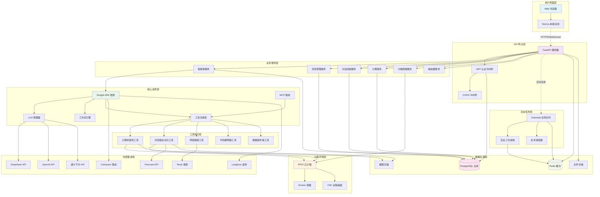

### 技术栈概览

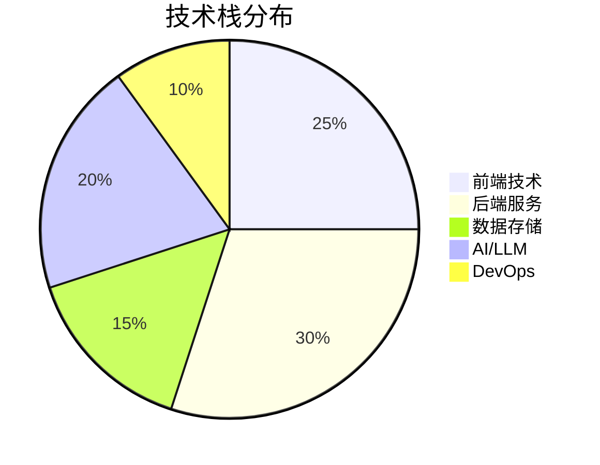

## 🚀 快速开始

### 系统要求

- **后端**: Python 3.11+
- **前端**: Node.js 18+
- **数据库**: PostgreSQL 17+, Redis 7+
- **Docker** (可选，用于容器化部署)
- **PPIO 账户** (用于沙箱环境)

### 安装步骤

#### 1. 克隆仓库
```bash
git clone https://github.com/zcxGGmu/Astraeus.git
cd Astraeus
```

#### 2. 前端设置
```bash
cd frontend  # 进入前端目录
npm install  # 或使用: npm ci 进行清洁安装
npm run dev  # 在 http://localhost:3000 启动前端
```

#### 3. 后端设置
```bash
cd backend  # 进入后端目录

# 创建虚拟环境
conda create -n astraeus python=3.11
conda activate astraeus

# 安装依赖
pip install -r requirements.txt
```

#### 4. 数据库设置
```bash
# 启动 PostgreSQL 和 Redis 服务
# (参见下面的详细设置说明)

# 配置数据库
python scripts/01_setup_database.py  # 配置 PostgreSQL
python scripts/02_setup_redis.py     # 配置 Redis
python scripts/03_init_astraeus_table.py  # 初始化表
```

#### 5. 环境配置
在后端目录创建 `.env` 文件：

```env
# 数据库配置
POSTGRES_HOST=localhost
POSTGRES_PORT=5432
POSTGRES_DB=astraeus
POSTGRES_USER=postgres
POSTGRES_PASSWORD=your_password

# Redis 配置
REDIS_HOST=localhost
REDIS_PORT=6379
REDIS_PASSWORD=your_redis_password

# PPIO 沙箱配置
E2B_DOMAIN=sandbox.ppio.cn
E2B_API_KEY=your_ppio_api_key
SANDBOX_TEMPLATE_CODE=br263f8awvhrqd7ss1ze
SANDBOX_TEMPLATE_DESKTOP=4imxoe43snzcxj95hvha
SANDBOX_TEMPLATE_BROWSER=7xvs3snis3tkuq3y8u96
SANDBOX_TEMPLATE_BASE=txi15v1zt0q72i1gcyqb

# LLM 配置
# DeepSeek
DEEPSEEK_API_KEY=your_deepseek_api_key
DEEPSEEK_API_BASE=https://api.deepseek.com
MODEL_TO_USE=deepseek/deepseek-chat

# OpenAI
OPENAI_API_KEY=your_openai_api_key
OPENAI_API_BASE=https://api.openai.com/v1
# MODEL_TO_USE=gpt-4o

# 其他 API 密钥
TAVILY_API_KEY=your_tavily_api_key
FIRECRAWL_API_KEY=your_firecrawl_api_key

# 应用设置
ENV_MODE=local
LOGGING_LEVEL=INFO
```

#### 6. 启动服务
```bash
# 终端 1: 启动 FastAPI 服务器
python api.py

# 终端 2: 启动后台工作进程
dramatiq run_agent_background
```

#### 7. 访问应用
- 前端: http://localhost:3000
- API: http://localhost:8000
- API 文档: http://localhost:8000/docs

## 📋 环境配置

### 数据库设置

#### PostgreSQL 安装

**Windows:**
1. 从 [EnterpriseDB](https://www.enterprisedb.com/downloads/postgres-postgresql-downloads) 下载
2. 使用默认设置运行安装程序
3. 设置 postgres 用户密码
4. 安装 pgAdmin 进行数据库管理

**Linux (Ubuntu/Debian):**
```bash
sudo apt update
sudo apt install postgresql postgresql-contrib
sudo systemctl start postgresql
sudo systemctl enable postgresql
```

创建数据库：
```sql
CREATE DATABASE astraeus;
CREATE USER astraeus WITH PASSWORD 'your_password';
GRANT ALL PRIVILEGES ON DATABASE astraeus TO astraeus;
```

#### Redis 安装

**Windows:**
1. 从 [redis-windows](https://github.com/redis-windows/redis-windows/releases) 下载
2. 解压并运行: `redis-server redis.conf`

**Linux:**
```bash
# Ubuntu/Debian
sudo apt install redis-server

# 或从源码编译
wget http://download.redis.io/releases/redis-7.0.4.tar.gz
tar -zxvf redis-7.0.4.tar.gz
cd redis-7.0.4
make
make install
redis-server redis.conf
```

### PPIO 沙箱设置

1. 在 [PPIO Console](https://ppio.com/console) 注册
2. 从仪表板获取 API 密钥
3. 记下沙箱模板的模板 ID

## 🔧 核心功能模块架构

### 1. 智能体执行系统架构

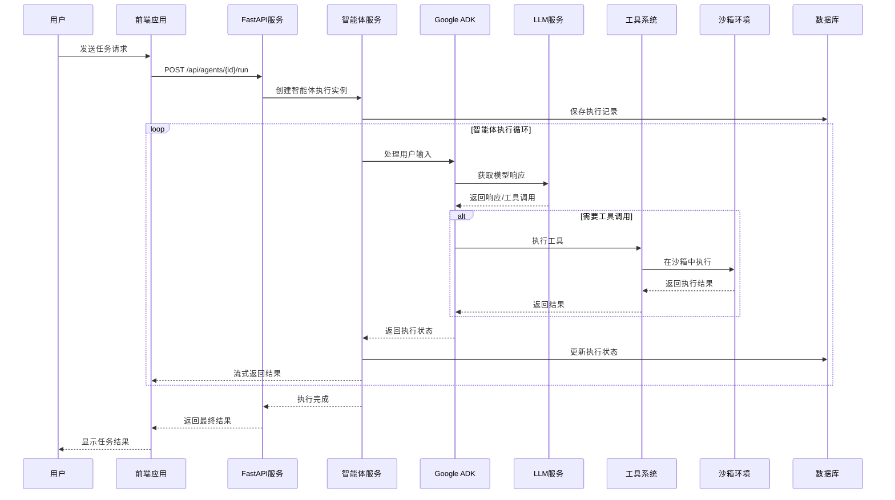

### 2. 数据流架构

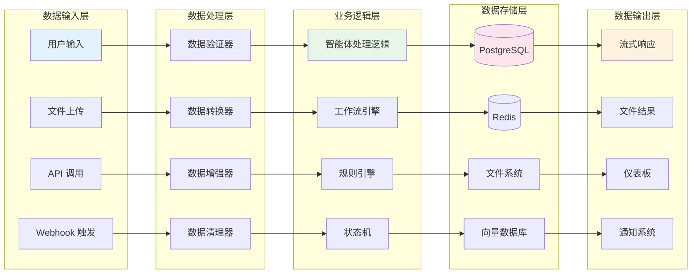

### 3. 沙箱环境架构

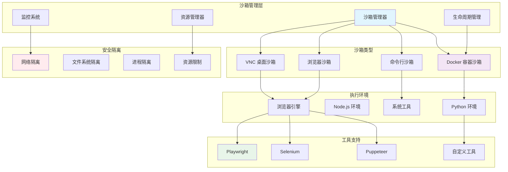

### 4. LLM 集成架构

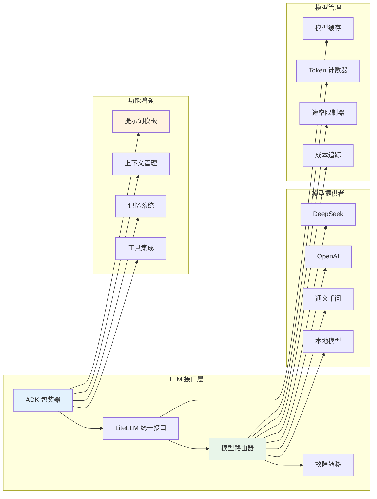

### 5. 工具系统架构

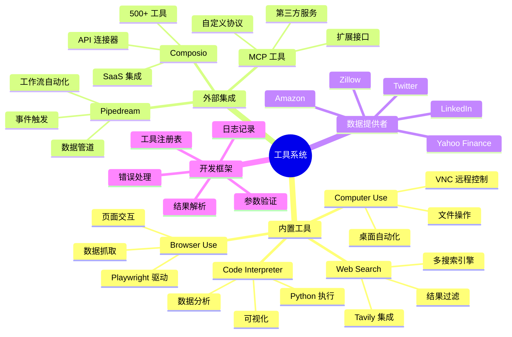

### 6. 数据库架构

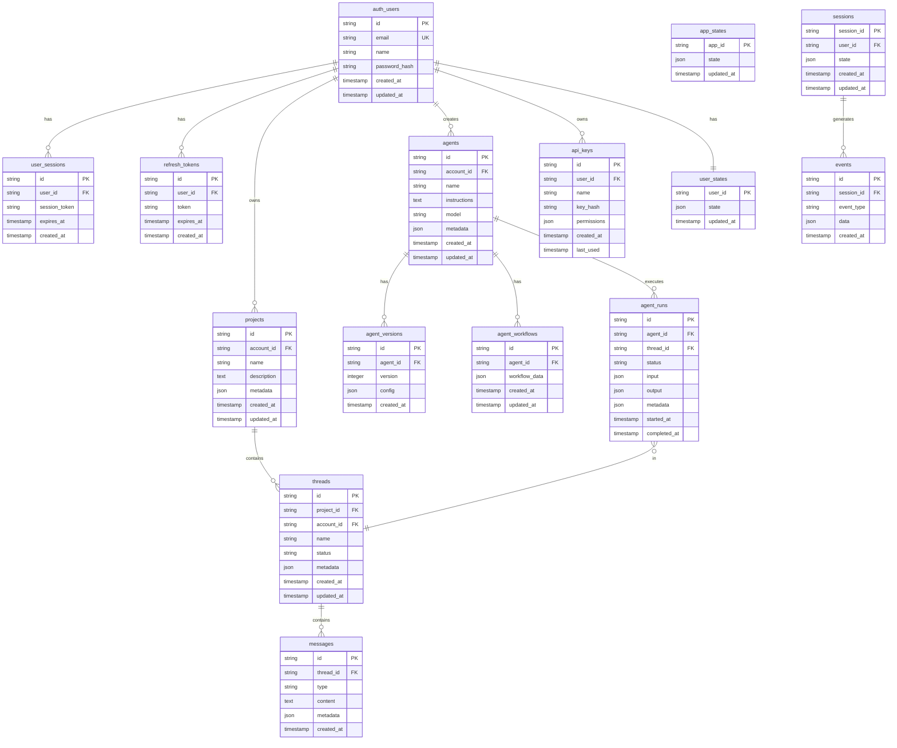

### 7. 安全架构

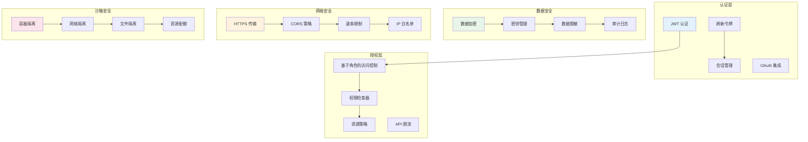

### 8. 部署架构

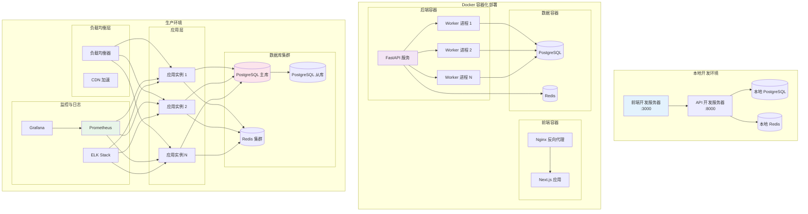

### 9. 监控与可观测性架构

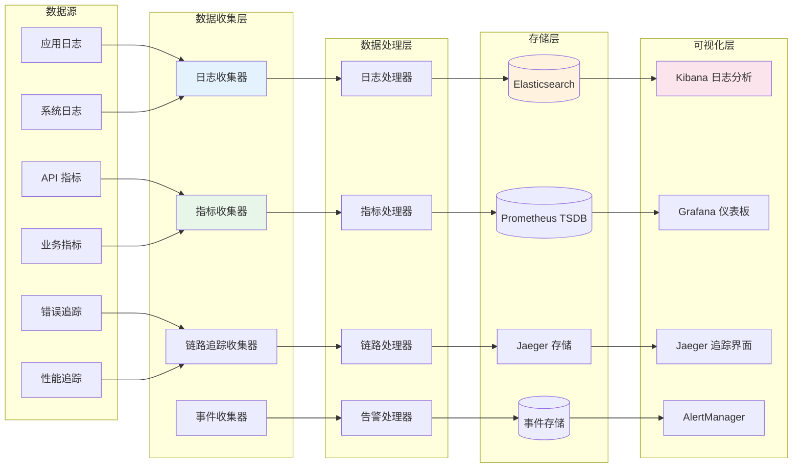

## 🎯 核心功能与模块

### 1. 用户认证模块
- 用户注册、登录和登出
- 权限管理
- 会话管理
- 对话历史管理

### 2. LLM 服务集成
- 在线模型：DeepSeek-chat、通义千问3、GPT-4o
- 本地模型：vLLM、Ollama REST API 集成
- 通过 Google ADK 框架统一管理

### 3. 智能体沙箱环境
- 创建、销毁和管理智能体沙箱环境
- 管理对话线程和文件资源
- 在隔离环境中执行外部工具

### 4. 外部工具集成
- 预建工具：
  - 网络搜索
  - 计算机使用（桌面自动化）
  - 浏览器使用（网络自动化）
  - 代码解释器
- 自定义 MCP 服务集成
- 自定义外部工具服务集成

## 📚 API 文档

### 认证

所有 API 端点都需要 JWT 认证：

```python
import requests

# 登录
response = requests.post("http://localhost:8000/auth/login", json={
    "email": "user@example.com",
    "password": "password"
})
token = response.json()["access_token"]

# 使用 token
headers = {"Authorization": f"Bearer {token}"}
```

### 主要端点

#### 认证
```http
POST   /auth/register          # 用户注册
POST   /auth/login             # 用户登录
POST   /auth/logout            # 用户登出
GET    /auth/me                # 获取当前用户信息
```

#### 项目
```http
GET    /api/projects           # 列出项目
POST   /api/projects           # 创建项目
GET    /api/projects/{id}      # 获取项目详情
PUT    /api/projects/{id}      # 更新项目
DELETE /api/projects/{id}      # 删除项目
```

#### 对话线程
```http
GET    /api/threads            # 列出线程
POST   /api/threads            # 创建线程
GET    /api/threads/{id}       # 获取线程消息
POST   /api/threads/{id}/messages  # 发送消息
```

#### 智能体
```http
GET    /api/agents             # 列出智能体
POST   /api/agents             # 创建智能体
GET    /api/agents/{id}        # 获取智能体详情
POST   /api/agents/{id}/run    # 执行智能体
```

## 🔧 开发

### 本地开发设置

1. **前端开发**
```bash
cd frontend
npm install
npm run dev    # 带热重载的开发服务器
npm run build  # 生产构建
```

2. **后端开发**
```bash
cd backend
pip install -r requirements.txt
python api.py    # 启动开发服务器
```

3. **代码结构**
```
├── agent/                # 智能体执行系统
│   ├── run.py           # 核心智能体运行器
│   ├── tools/           # 智能体工具目录
│   └── config/          # 智能体配置
├── auth/                # 认证系统
├── composio_integration/ # 第三方集成
├── sandbox/             # 沙箱环境
├── services/            # 核心服务（数据库、Redis 等）
├── triggers/            # 事件触发器
├── utils/               # 共享工具
└── api.py              # FastAPI 应用入口
```

### 测试

```bash
# 运行所有测试
pytest

# 运行特定测试
python tests/03_test_simple_browser.py
```

## 🐳 Docker 部署

### 开发 Docker

```bash
# 构建并启动所有服务
docker-compose up -d

# 查看日志
docker-compose logs -f

# 停止服务
docker-compose down
```

### 生产 Docker

1. **构建镜像**
```bash
docker build -t astraeus:latest .
```

2. **使用 Docker Compose 部署**
```bash
docker-compose -f docker-compose.yml up -d
```

3. **扩展工作进程**
```bash
docker-compose up -d --scale worker=4
```

## 📊 监控与可观测性

### 日志记录
平台使用 Structlog 进行结构化日志记录：
```python
from utils.logger import logger

logger.info("智能体已执行", agent_id="123", duration=5.2)
```

### 使用 Langfuse 进行指标追踪
追踪智能体性能和用户交互：
```python
from services.langfuse import langfuse

# 自动追踪智能体运行
```

### 使用 Sentry 进行错误追踪
```python
import sentry_sdk

# 如果配置了 SENTRY_DSN，错误会自动报告
```

## 🔐 安全考虑

- 所有凭据使用 AES-256 加密存储
- API 密钥安全存储在环境变量中
- 沙箱提供与主机系统的完全隔离
- 可配置过期时间的 JWT 令牌
- Web 应用程序的 CORS 保护
- API 端点速率限制
- 通过 SQLAlchemy ORM 防止 SQL 注入

## 🌟 平台优势

Astraeus 为 AI 智能体开发提供了几个关键优势：

- **本地优先架构** - 完整的数据隐私和控制
- **灵活的 LLM 集成** - 通过 Google ADK 支持多个提供商
- **安全沙箱环境** - 使用 PPIO 进行隔离执行
- **可扩展设计** - 专为开发和生产环境构建
- **开发者友好** - 易于设置和全面的文档

## 🛠️ 可用工具

| 工具 | 描述 | 使用场景 |
|------|-------------|----------|
| **Computer Use** | 通过 VNC 进行桌面自动化 | GUI 交互、系统任务 |
| **Browser Tool** | 使用 Playwright 进行网络自动化 | 爬虫、表单填充、测试 |
| **Web Search** | Tavily API 集成 | 信息收集 |
| **Code Interpreter** | Python 代码执行 | 数据分析、计算 |
| **Task List** | 项目管理 | 任务跟踪和组织 |
| **MCP Tools** | 自定义工具集成 | 可扩展功能 |

## 🤝 贡献

我们欢迎贡献！请遵循以下步骤：

1. Fork 仓库
2. 创建功能分支：`git checkout -b feature/amazing-feature`
3. 提交更改：`git commit -m 'Add amazing feature'`
4. 推送到分支：`git push origin feature/amazing-feature`
5. 打开 Pull Request

### 开发指南

- Python 代码遵循 PEP 8
- 尽可能使用类型提示
- 为新功能编写单元测试
- 更新 API 更改的文档
- 确保 CI/CD 流程通过

## 📄 许可证

本项目在 MIT 许可证下授权 - 详见 [LICENSE](LICENSE) 文件。

## 🙏 致谢

- [Google ADK](https://github.com/google/agent-development-kit) - 智能体开发框架
- [LiteLLM](https://github.com/BerriAI/litellm) - 统一 LLM 接口
- [FastAPI](https://fastapi.tiangolo.com/) - 现代 Web 框架
- [Dramatiq](https://dramatiq.io/) - 可靠的任务处理
- [Playwright](https://playwright.dev/) - 浏览器自动化
- [PPIO](https://ppio.com/) - 云沙箱平台

## 📞 支持

如需支持和问题：

- 🐛 [报告 Bug](https://github.com/zcxGGmu/Astraeus/issues)
- 💬 [讨论](https://github.com/zcxGGmu/Astraeus/discussions)
- 📧 邮箱: support@astraeus.ai
- 📱 微信群: 扫描文档中的二维码

---

用 ❤️ 为全球 AI 开发者社区构建